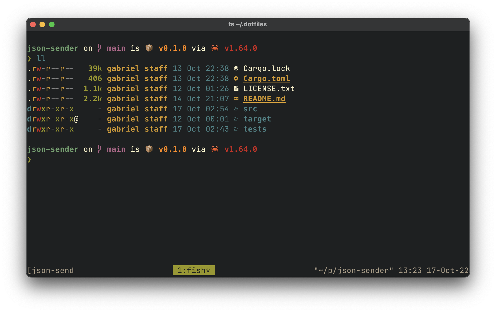
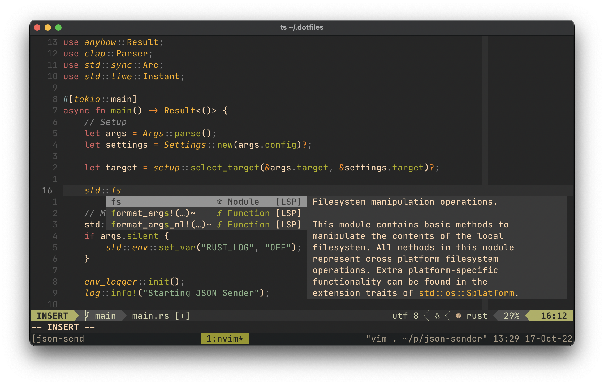

# Dotfiles




I'm currently using MacOS and Ubuntu. These config files should work for both systems.
You can manage them with [GNU Stow](https://www.gnu.org/software/stow/):

```sh
stow */             # set config files of all packages

stow <package name> # set config files of a specific package
```

## Info:
- Terminal: [Alacritty](https://alacritty.org/);
- Shell: [Fish](https://fishshell.com);
- Shell Prompt: [Startship](https://starship.rs);
- Multiplexer: [Tmux](https://github.com/tmux/tmux);
- Editor: [Neovim](https://neovim.io/);

## Neovim:
To manage neovim plugins, you will need [Packer](https://github.com/wbthomason/packer.nvim#quickstart) installed.

## ZSH:
To manage ZSH plugins and themes, you will need [Oh My Zsh](https://ohmyz.sh/) installed.

## Issues:
- ### NVM inside Fish
  NVM won't work with fish. You can enter another shell and use it from there.

- ### Tmux italic text
  To enable italic text on Tmux, make sure to:
  ```sh
    tic -x tmux.terminfo
  ```

  See more in this [guide](https://herrbischoff.com/2020/08/how-to-enable-italics-in-tmux/).
